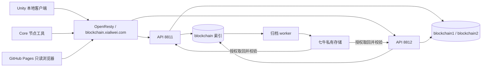

# HOTPOOR FairDeck · 工程架构 v0.1

日期：2026-09-21。当前为基础原型，尚无完整扑克对局、分布式共识、智能合约和零知识洗牌。

## 三个工程目录

| 目录 | 用途 | 当前实现 |
| --- | --- | --- |
| core | 区块链协议与节点基础 | UUID 路由、钱包签名、节点登记和发现工具 |
| server | 节点连接、索引和存储 | 多端口 API、三库模式、不可变实体、归档队列、授权读取 |
| apps/unity/HOTPOOR_Poker | 本地游戏客户端 | 桌前场景、钱包创建/单选、签名登录 |
| apps/explorer | GitHub Pages 浏览器 | 只读查询线上公开节点及实体 |

节点目录与数据库不等同于区块链，API 明确返回 `consensus: not-implemented`。P2P 同步、节点互验、共识与多人游戏状态同步仍需开发。

## 数据路径

## PostgreSQL 三库

- `blockchain`：身份、挑战、会话、节点、局内成员和实体索引，不保存实体正文。
- `blockchain1`、`blockchain2`：各只有一张应用表 `entities`。
- `block_id` 是不带连字符的 32 位小写 UUID 十六进制文本，不是 32-bit 整数。
- 分片：`1 + int(block_id, 16) % 2`。余数 0 写 blockchain1；余数 1 写 blockchain2。
- 实体字段：`block_id char(32)`、`body JSONB`、`updatetime timestamptz`、`createtime timestamptz`。
- 相同 ID 的不同内容拒绝覆盖；索引事务协调多端口写入。
- 跨库不是同一事务：先写分片后提交索引，崩溃可能产生孤立实体；重试校验摘要，不覆盖不同正文。

## 锁定与七牛

状态 `hot → pending → archived`。存储锁定请求把索引标记 pending，作为持久队列。
Worker 校验正文摘要，上传固定对象键，再下载回读验证 SHA-256，成功后提交 archived 和对象键。
失败保留本地原件与队列状态；v0.1 成功后也保留热副本，空间回收另行实现。
API 查询先鉴权，再取回云端内容并校验；不向未授权方返回私有下载链接。

该锁定是存储归档入口，不代表游戏投票/终局已被验证。当前仅开放本机 operator 操作；正式环境应由验证终局的组件调用。
私密牌局正文必须由客户端按后续协议加密，服务器不能把明文自动变成“运营方不可见”。当前实体权限只有 owner-private 和 public，两者不等同于完整四档揭秘。

## 节点信息

节点每 30 秒续租，90 秒内有效；可获取自身声明 IP:PORT 与服务端观察 IP。
公开列表只收录主动同意发布的节点。局内 peers 需通过 `game_members` 成员检查；成员索引暂由受信部署方预置，正式入局协商尚未实现。
登记不证明端口可达，也不证明玩家没有作弊。NAT、端口探测、中继与链数据同步尚未实现。

## 本机钱包与地址冲突

钱包第一版为 RSA-3072 身份签名，地址是规范公钥编码 SHA-256，前缀 `fd1_`。不是 Ethereum 资产钱包；未来算法变更需做版本兼容。

JSON 含版本、公钥、地址、PBKDF2 盐与迭代参数、IV、私钥密文和 MAC。
密码使用 PBKDF2-HMAC-SHA256（600000 次）派生独立加密/认证密钥，AES-256-CBC 加密，HMAC-SHA256 认证头部与密文，先验 MAC 后解密。
密码哈希用于本地派生和校验，不另存一个线上登录密码哈希。密码、私钥和钱包 JSON 均不上传。

服务器发送两分钟有效、绑定网络/域名/地址的一次性挑战，客户端本机签名，服务器验证后签发 30 分钟会话，数据库只存会话令牌摘要。多端口共用同一挑战消费状态。

用户确认的新地址冲突规则：地址已属于不同公钥时拒绝登记，客户端提示重新生成新钱包；不覆盖旧文件。相同公钥与地址来自备份恢复时正常验证，不误判冲突。

钱包存于 Unity 项目或 Windows 游戏 exe 旁的 `wallet/`。可复制 JSON 并用原密码解锁。列表可以有多个钱包，但当前测试会话只能单选一个，退出测试会话后才能切换。正式对局锁定需接入后续游戏状态机。
场景为坐姿眼高摄像机和桌面，钱包面板暂用屏幕 UI，尚非完整世界空间交互。

## 部署与下一步

目标 API：`https://blockchain.xialiwei.com`。配置不等于 DNS/TLS/服务器已上线。
用户正在准备服务器位置、DNS 与七牛配置；目前先提交工程、部署模板和 Pages 工作流。

后续：游戏状态机、集体配置、协议密钥、零知识洗牌、故障恢复、四档揭秘、共识、链同步、安全评审。
登录钱包只解决身份基础，不能代替密码学扑克协议。
