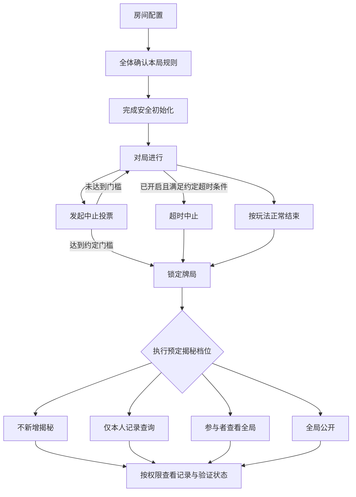

# HOTPOOR扑克 · 游戏机制

版本：0.1  
整理日期：2026-09-21  
状态：产品机制规划；游戏及密码学协议尚未实现。

本文整理目前共同讨论的规则，作为后续设计入口。标注“待定”或“建议”的内容不属于已确认需求。此前讨论稿中与本文冲突的早期设想，以本文为准。

## 1. 游戏定位

HOTPOOR扑克计划支持多种扑克玩法，共用牌桌交互、房间约定、牌局生命周期与验证能力。第一种玩法尚未确定。

当前优先关注：

- 交互：玩家清楚知道自己可以做什么、牌局处于什么状态。
- 数据安全：局中隐藏牌不应被运营方或无权查看的玩家获取。
- 公平验证：玩家能够独立核验系统声称已验证的内容。
- 集体约定：结束条件与揭秘权限在开局前明确，不能局中被单方面修改。

公平公正是设计原则。具体安全能力必须通过协议设计、测试与审查证明，不将“绝对公平”作为已实现的技术结论。

## 2. 开局前共同确认

房间提出配置，本局所有参与者确认同一份规则后才开局。配置变化后需重新确认，不能沿用对旧配置的同意。

| 配置项 | 机制 | 当前状态 |
| --- | --- | --- |
| 游戏玩法、规则版本 | 决定合法行动与正常结束条件 | 首个玩法待定 |
| 本局参与者 | 确定投票分母及赛后参与者权限 | 绑定本局，身份实现待定 |
| 中止投票门槛 | 超过半数，或至少三分之二 | 支持开局约定 |
| 超时自动终局 | 开启或关闭 | 支持开局约定 |
| 超时条件、时长 | 开启时必须明确何时触发 | 定义与时长待定 |
| 赛后揭秘档位 | 四档之一，见第 6 节 | 已确认四档方向 |
| 中止后的计分方式 | 区分中止和正常结算 | 待定 |

客户端应显示具体票数和权限描述，不只显示比例或技术名词。

## 3. 牌局生命周期

“未达到门槛”表示没有发生终局转换，不代表故障已解除或牌局一定能够继续。投票期间是否暂停操作、投票期限及重复发起规则待定。

### 锁定的含义

- 固定本局最终有效状态、结束原因和适用规则。
- 不再接受新的出牌、发牌或改变本局结果的操作。
- 不允许揭秘后重新恢复本局继续打牌。
- 后续仅执行已约定的揭秘、记录查询和验证流程。
- 正常完成、投票中止、超时中止分别标记；中止不自动等于正常胜负结算。

终局确认、并发操作先后顺序以及链上最终性属于待设计的协议细节。

## 4. 客户端交互

### 开局

展示本局规则摘要，玩家逐个确认。无需让玩家手动处理密钥、随机数或密码学证明。

### 对局中

保留两个不同入口：

- **中途离开**：表达个人退出意图，不自动代表整局结束。离开后是否托管、自动行动或等待，需按玩法另行约定。
- **提议结束本局**：发起中止投票，展示当前赞成票、所需票数及通过后的结果。

正常结束时，客户端进入终局页面；主动发起结束不能绕过合约约定。

点击、拖动、自由摆牌、二维或三维牌桌等具体交互尚未确定。

### 终局后

显示结束原因、揭秘档位及执行状态。需要揭秘时，客户端可接收请求并自动提交本局专用材料；恢复流程不能仅依赖所有玩家此刻仍然在线。

查询与回放必须遵守本局档位。无法获得完整牌局的档位，不能显示为拥有完整信息的回放。

## 5. 中止投票与超时

### 5.1 投票门槛

以开局绑定的全部参与者人数 N 为分母，离线不自动缩小分母。

- 超过半数：所需票数为 floor(N / 2) + 1。
- 至少三分之二：所需票数为 ceil(2N / 3)。

| 本局人数 | 超过半数 | 至少三分之二 |
| --- | --- | --- |
| 2 | 2 | 2 |
| 3 | 2 | 2 |
| 4 | 3 | 3 |
| 5 | 3 | 4 |
| 6 | 4 | 4 |

本版“三分之二”指达到该比例即可，包含恰好三分之二。每位参与者对同一提案仅计一票；具体身份与防重放机制待实现。

### 5.2 超时策略

- **关闭**：超时本身不授权自动结束；仍按正常结束或中止投票规则处理。
- **开启**：满足开局约定的条件后，终止并锁定牌局，再执行预定档位。

不得因超时或投票中止自动把“仅本人”升级为“全局公开”。

关闭自动超时且凑不齐票时，可能持续等待。这个结果必须在开局前说明，不能让运营方临时新增结束权限。

### 5.3 在线状态

持续响应检查可记录最近响应时间与是否超时。是否每次都提交链上交易、检查频率、重连窗口均待定。

系统只能确认收到或未收到有效响应，不能可靠判定是真断网、假掉线、设备故障还是永远不上线。处置按预先约定的事实条件执行，不以猜测动机作为依据。

## 6. 四档赛后揭秘权限

| 档位 | 名称 | 终局后可见内容 |
| --- | --- | --- |
| 1 | 不额外揭秘 | 原本隐藏的牌继续保密，不新增揭示；已亮出的信息不会被撤回 |
| 2 | 仅查询本人记录 | 每位参与者只能查询自己的私有记录和原本公开的信息，不能查询其他人的隐藏牌 |
| 3 | 参与者共享全局 | 每位本局参与者可查询完整牌局，系统不向局外人开放 |
| 4 | 全局公开 | 完整牌局可向公众查询 |

### 档位边界

- 第 1 档是否保留个人历史记录、保留多久，尚待确定；它与第 2 档的主要区别是是否提供赛后本人记录查询。
- 第 2 档允许参与者自愿汇集各自记录，复原他们共同持有的信息。不能强制仅在线下汇集，也不能保证仅靠各自手牌就能补齐未发出的牌等全局隐藏信息。
- 第 3 档约束系统提供数据的范围，不能阻止参与者截图或转发。
- 第 4 档“公开”的具体字段需要定义，不等于公开账号凭据、个人资料或长期密钥。
- “完整牌局”是否包含未发出的牌及完整牌堆顺序，待按玩法明确。

揭秘权限和结束条件是两个独立设置：前者决定谁能看到什么，后者决定何时锁定牌局。

## 7. 安全与验证目标

### 已确认的目标

- 对局中，运营方不能获取全部隐藏手牌，不能指定谁拿到好牌。
- 玩家只获取当前有权知道的信息。
- 不能偷偷改牌、改行动记录或改结果而仍通过对应验证。
- 系统提供可供玩家独立检查的证明与规则版本，验证范围明确。
- 有人离线后，在已约定结束条件满足、恢复机制的可用性假设成立时，仍可执行该档位允许的终局处理。

### 必须满足的设计约束

1. 不能在局中公开足以重建整副牌的随机种子。公开种子后再加密存储无法补救泄牌。
2. 不能先由运营方生成全部明文手牌，再仅靠分别加密声称运营方不可见。
3. 本局专用解密材料与账号令牌、长期私钥严格区分，后两者不得作为揭秘材料上传。
4. 第 1 至 3 档不能把足以公开解开全局的数据提交到公开链；私密查询与公共证明须分开设计。
5. 开局前需完成恢复机制的必要准备和验证；否则不能承诺无需所有人赛后配合。
6. 恢复机制必须同时证明不会被用于提前解密。合约、超时和备用材料本身不自动提供这一保证。
7. 下一局独立初始化随机性与本局密钥，不能因上一局揭秘泄露下一局。

“不额外揭秘”与“验证公平”是不同维度。隐藏信息下的完整验证可能需要额外密码学证明，具体能力待验证。

建议验证页面分别显示：通过、失败、证据不足、未覆盖。证明尚未就绪不应显示为通过，也不应直接推断玩家作弊。

## 8. 合约与系统分工（设计方向）

| 部分 | 职责 |
| --- | --- |
| Unity 客户端 | 牌桌操作、规则确认、投票、状态展示、按权限查询 |
| 玩法规则模块 | 合法行动、正常终局、计分及规则版本 |
| 密码学协议 | 隐私发牌、有效性证明、受限解密及恢复 |
| 智能合约 | 按共同约定验证状态转换、计票与终局条件，协调证明和揭秘 |
| 数据与验证服务 | 保存或提供授权数据、证明与独立验证所需材料 |

链、协议、库、节点与费用方案尚未选型。链上记录不自动证明其内容真实；合约也不会凭空补齐丢失的秘密。

安全边界须包含串通阈值、密钥管理与恢复参与方。玩家私下串通、终端被控制，以及所有恢复方或底层网络不可用，不能笼统宣称已解决。

## 9. 待逐项讨论

1. 第一种玩法及目标平台。
2. 具体牌桌交互形式。
3. 超时按个人未操作还是整桌无进展计算，以及时长。
4. 投票期间是否暂停、何时失效、能否撤票。
5. 个人离开后的行动方式，以及中止局计分。
6. 本人记录与全局记录的字段、未发牌处理、保存期限及删除规则。
7. 恢复协议、合约部署、身份与费用方案。

继续按“一次讨论一个问题”的方式推进，不把待定项自动转为默认需求。

## 10. 后续验收清单（尚未执行）

- 玩家确认的配置一致，局中不能被单方面修改。
- 票数计算正确，离线不改变分母，同一票不能重复计算。
- 未启用的超时策略不能触发终局。
- 锁局后拒绝新的游戏行动，不能在揭秘后恢复对局。
- 四档查询权限分别有效，超时和中止不扩大权限。
- 局中无权方无法通过网络数据、证明或日志恢复隐藏手牌。
- 已满足终局条件后，单个玩家不配合时能在所声明假设下完成授权恢复。
- 拒绝、篡改、缺失证明分别呈现真实状态，不能伪报验证通过。

## 相关文档

- [项目规划](GAME_PLAN.md)
- [原方案评审与讨论记录](VERIFIABLE_GAME_REVIEW.md)

原始参考：用户提供的《可验证棋牌游戏系统方案.md》。该文件中的链、保证金、商业模式与具体 Demo 建议，不自动构成本项目已确认需求。
